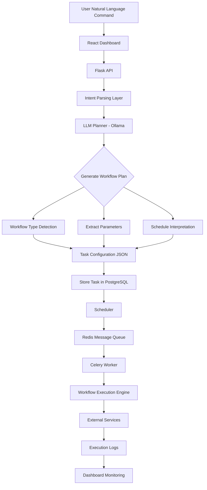
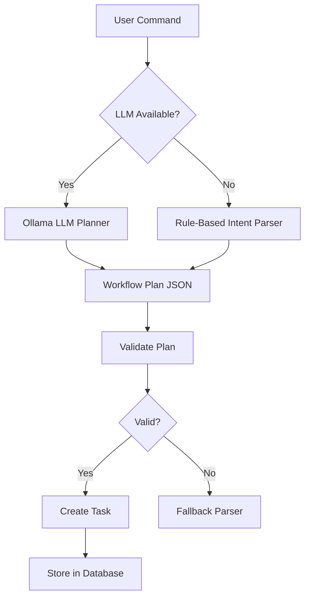

# 🚀 UAOS - Unified AI Automation Operating System

> AI-driven automation platform that converts natural language into scheduled workflows using LLM planning and distributed execution.

[](https://www.python.org/downloads/)
[](https://reactjs.org/)
[](LICENSE)

## 📋 Table of Contents

- [Overview](#overview)
- [Key Features](#key-features)
- [Project Structure](#project-structure)
- [Architecture](#architecture)
- [AI Planning Flow](#ai-planning-flow)
- [Tech Stack](#tech-stack)
- [Quick Start](#quick-start)
- [Workflows](#workflows)
- [Screenshots](#screenshots)
- [API Documentation](#api-documentation)
- [Deployment](#deployment)
- [Example Automations](#example-automations)
- [Contributing](#contributing)

---

## 🎯 Overview

UAOS is an AI-powered automation platform prototype that converts natural language commands into executable workflows. Users can create and schedule complex automations without writing code, powered by machine learning intent classification and LLM-based multi-step planning.

### Problem Statement

Manual automation setup is time-consuming and requires technical knowledge. UAOS bridges this gap by enabling natural language task creation with intelligent workflow decomposition.

### Solution

A full-stack platform combining:
- 🧠 **AI-powered intent parsing** (TF-IDF + LLM)
- ⚙️ **Distributed task execution** (Celery + Redis)
- 🔄 **Smart scheduling** (APScheduler / Celery Beat)
- 📊 **Real-time monitoring** (React dashboard)

---

## ✨ Key Features

### 🤖 Natural Language Interface
- Parse complex queries: *"Every Monday morning, clean my Downloads and email me a summary"*
- Multi-step workflow decomposition with LLM
- Confidence scoring and fallback strategies

### 🔧 Built-in Workflows
1. **News Digest** - Aggregate news from APIs and email delivery
2. **File Cleanup** - Intelligent file organization and renaming
3. **Invoice Sync** - Gmail → Google Drive automation with OAuth2

### 🎯 Advanced Scheduling
- Cron-based periodic execution
- Natural language schedule parsing: *"every Friday at 6 PM"*
- Timezone-aware (Asia/Kolkata)

### 📈 Production-Ready Architecture
- Distributed workers with Celery
- Redis message broker
- PostgreSQL persistence
- Execution logging and monitoring

## 📂 Project Structure

```text
UAOS/
│
├── backend/                         # Flask backend API
│   │
│   ├── app/
│   │   ├── __init__.py               # Flask app factory
│   │   ├── models.py                 # Database models
│   │   │
│   │   ├── api/                      # REST API routes
│   │   │   └── routes.py
│   │   │
│   │   ├── core/                     # Core system logic
│   │   │   ├── llm_planner_free.py   # Ollama LLM workflow planner
│   │   │   ├── scheduler.py          # APScheduler setup
│   │   │   └── celery_scheduler.py   # Celery task scheduling
│   │   │
│   │   ├── engines/                  # Automation engines
│   │   │   ├── file_engine.py
│   │   │   └── desktop_engine.py
│   │   │
│   │   ├── workflows/                # Workflow implementations
│   │   │   ├── base.py
│   │   │   ├── news_digest.py
│   │   │   ├── file_cleanup.py
│   │   │   └── invoice_sync.py
│   │
│   ├── celery_worker.py              # Celery worker entrypoint
│   ├── config.py                     # Environment configuration
│   ├── run.py                        # Flask application launcher
│   └── requirements.txt
│
├── frontend/                         # React dashboard
│   │
│   ├── src/
│   │   ├── App.jsx                   # Main dashboard UI
│   │   ├── api.js                    # API communication layer
│   │   └── components/               # Reusable UI components
│   │
│   ├── package.json
│   └── vite.config.js
│
├── docs/                             # Documentation
│   ├── API.md
│   ├── DEPLOYMENT.md
│   └── screenshots/
│       ├── dashboard.png
│       ├── create-task.png
│       └── logs.png
│
├── docker-compose.yml                # Container orchestration
├── .env.example                      # Environment variables template
├── .gitignore
└── README.md
```
---

## 🏗️ Architecture

```text

                     ┌─────────────┐
                     │    User     │
                     └──────┬──────┘
                            │
                            ▼
                ┌──────────────────────┐
                │   React Dashboard    │
                │   (Task Management)  │
                └──────────┬───────────┘
                           │ REST API
                           ▼
                 ┌──────────────────────┐
                 │      Flask API       │
                 │  Task + Workflow API │
                 └──────────┬───────────┘
                            │
                            ▼
                 ┌──────────────────────┐
                 │   Intent Parser +    │
                 │    LLM Planner       │
                 │    (Ollama Local)    │
                 └──────────┬───────────┘
                            │
            ┌───────────────┴────────────────┐
            ▼                                ▼
     ┌─────────────┐                 ┌──────────────────┐
     │ PostgreSQL  │                 │ Redis (Broker)   │
     │ Tasks +     │                 │ Message Queue    │
     │ Logs + Plans│                 └────────┬─────────┘
     └─────────────┘                          │
                                              ▼
                                   ┌──────────────────────┐
                                   │    Celery Workers    │
                                   │                      │
                                   │  • News Digest       │
                                   │  • File Cleanup      │
                                   │  • Invoice Sync      │
                                   └──────────┬───────────┘
                                              │
                                              ▼
                                   ┌──────────────────────┐
                                   │   External Services  │
                                   │                      │
                                   │ • NewsAPI            │
                                   │ • Gmail API          │
                                   │ • Google Drive API   │
                                   │ • Local File System  │
                                   └──────────────────────┘

```
---

## AI Planning Flow
This explains how a natural-language task becomes an executable workflow.



## LLM Planning Logic



## 🛠️ Tech Stack

### Backend
- **Framework:** Flask 3.0
- **Database:** PostgreSQL 14
- **ORM:** SQLAlchemy
- **Task Queue:** Celery 5.3 + Redis 5.0
- **Scheduler:** APScheduler / Celery Beat
- **AI/ML:** scikit-learn (TF-IDF), Ollama (Llama 3.2 local model)

### Frontend
- **Framework:** React 18 + Vite
- **Styling:** Tailwind CSS
- **Icons:** Lucide React
- **State:** React Hooks

### APIs & Services
- NewsAPI (news aggregation)
- Gmail API (email operations)
- Google Drive API (cloud storage)
- Ollama (local LLM - FREE)

---

## 🚀 Quick Start

### Prerequisites
- Python 3.10+
- Node.js 18+
- PostgreSQL 14+
- Redis 5+
- Ollama (for AI planning)

### 1. Clone Repository
```bash
git clone https://github.com/krishtech11/UAOS.git
cd uaos
```

### 2. Backend Setup
```bash
cd backend

# Create virtual environment
python -m venv venv
source venv/bin/activate  # Windows: venv\Scripts\activate

# Install dependencies
pip install -r requirements.txt

# Create PostgreSQL database
createdb uaos_db

# Configure environment
cp .env.example .env
# Edit .env with your API keys

# Run migrations
python run.py
```

### 3. PostgreSQL setup example

```sql
CREATE DATABASE uaos_db;
CREATE USER uaos WITH PASSWORD 'password';
GRANT ALL PRIVILEGES ON DATABASE uaos_db TO uaos;
```
---

### 4. Frontend Setup
```bash
cd frontend

# Install dependencies
npm install

# Start dev server
npm run dev
```

### 5. Install Ollama (for FREE AI planning)
```bash
# Download and install from https://ollama.ai/download

# Pull the model (one-time, 2GB download)
ollama pull llama3.2:3b

# Start Ollama server
ollama serve
```

### 6. Start Services
```bash
# Terminal 1: Ollama (AI Planning)
ollama serve

# Terminal 2: Redis
redis-server

# Terminal 3: Flask API
cd backend && python run.py

# Terminal 4: Celery Worker
cd backend && celery -A celery_worker worker --loglevel=info

# Terminal 5: Celery Beat (optional, for scheduled tasks)
cd backend && celery -A celery_beat beat --loglevel=info
```

### 7. Access Dashboard
Open http://localhost:3000


## 📚 Workflows

### 1. News Digest
**Description:** Fetch news from NewsAPI and email formatted digest

**Configuration:**
```json
{
  "email": "user@example.com",
  "category": "technology",
  "country": "in",
  "limit": 10
}
```

**Example:** *"Send me top 10 tech news every Friday at 6 PM"*

### 2. File Cleanup
**Description:** Scan, rename, and organize files in local folders

**Configuration:**
```json
{
  "folder": "Downloads",
  "file_pattern": "*.pdf",
  "action": "rename",
  "rename_pattern": "date_title"
}
```

**Example:** *"Clean my Downloads folder PDFs daily at 11 PM"*

### 3. Invoice Sync
**Description:** Extract invoices from Gmail and upload to Google Drive

**Configuration:**
```json
{
  "gmail_filter": "has:attachment (invoice OR receipt)",
  "drive_folder": "Invoices",
  "organize_by_date": true
}
```

**Example:** *"Sync Gmail invoices to Drive every Monday"*

---

## 📸 Screenshots

**Dashboard Overview**


**Task Creation**


**Execution Logs**


---

## 📖 API Documentation

### Base URL
```
http://localhost:5000/api
```

### Endpoints

#### Create Task
```http
POST /api/tasks
Content-Type: application/json

{
  "raw_text": "Send me tech news daily",
  "schedule": "daily",
  "use_llm": true
}

Response: 201 Created
{
  "id": 1,
  "message": "Task created successfully",
  "task": {
    "id": 1,
    "parsed_type": "NEWS_DIGEST",
    "schedule": "daily_18_0",
    "confidence": 0.95,
    "next_run": "2026-02-23T18:00:00+05:30"
  }
}
```

#### Get Tasks
```http
GET /api/tasks

Response: 200 OK
{
  "tasks": [
    {
      "id": 1,
      "raw_text": "Send me tech news daily",
      "parsed_type": "NEWS_DIGEST",
      "status": "ACTIVE",
      "next_run": "2026-02-23T18:00:00+05:30",
      "total_executions": 5
    }
  ]
}
```

#### Execute Task Manually
```http
POST /api/tasks/{id}/execute

Response: 200 OK
{
  "message": "Task execution triggered",
  "task_id": 1
}
```

#### Get Execution Logs
```http
GET /api/logs

Response: 200 OK
{
  "logs": [
    {
      "id": 1,
      "task_id": 1,
      "status": "SUCCESS",
      "message": "Sent 10 news articles",
      "start_time": "2026-02-22T18:00:00+05:30",
      "duration": 2.5
    }
  ]
}
```

[Full API Documentation](docs/API.md)


## Example Automations


- Send me top 10 tech news every Friday at 6 PM  
- Clean my Downloads folder PDFs daily at 11 PM  
- Sync Gmail invoices to Drive every Monday  

---

## 🚢 Deployment

### Docker Deployment
```bash
# Build images
docker-compose build

# Start services
docker-compose up -d

# View logs
docker-compose logs -f
```

### Railway Deployment
1. Fork this repository
2. Connect to Railway
3. Add environment variables
4. Deploy!

[Detailed Deployment Guide](docs/DEPLOYMENT.md)

---

## 🤝 Contributing

Contributions are welcome! Please follow these steps:

1. Fork the repository
2. Create feature branch (`git checkout -b feature/amazing-feature`)
3. Commit changes (`git commit -m 'Add amazing feature'`)
4. Push to branch (`git push origin feature/amazing-feature`)
5. Open Pull Request

See [CONTRIBUTING.md](CONTRIBUTING.md) for guidelines.

---

## 📝 License

This project is licensed under the MIT License - see [LICENSE](LICENSE) file.

---

## 👤 Author

**Krishna Arora**
- GitHub: [@krishtech11](https://github.com/krishtech11)
- LinkedIn: [Krishna Arora](https://linkedin.com/in/krishna-arora-83b87a26b/)
- Email: krishnaarora747@gmail.com

---

## 🙏 Acknowledgments

- NewsAPI for news aggregation
- Google APIs for Gmail and Drive integration
- Ollama team for FREE local LLM
- Meta for Llama 3.2 model
- The open-source community

---

## 📈 Project Stats

- **Lines of Code:** ~5,000+
- **Development Time:** 10 weeks
- **Technologies:** 15+
- **Workflows:** 3 (extensible)
- **Test Coverage:** Planned

---

## 🔮 Future Roadmap

- [ ] Web scraping workflows
- [ ] Slack/Discord integrations
- [ ] Mobile app (React Native)
- [ ] Workflow marketplace
- [ ] Multi-user support with teams
- [ ] Advanced analytics dashboard

---

**⭐ Star this repo if you find it useful!**